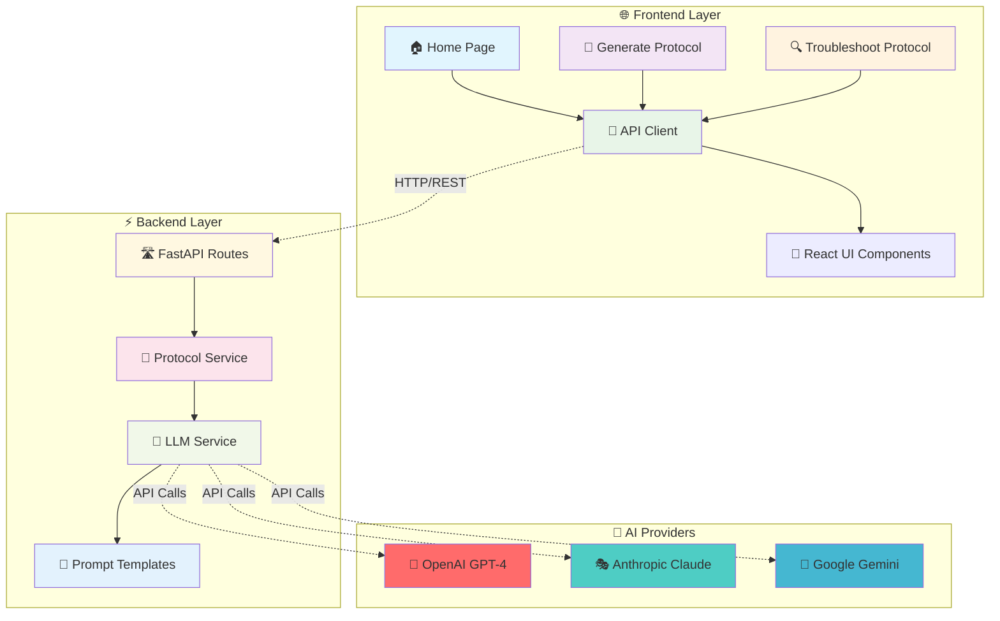
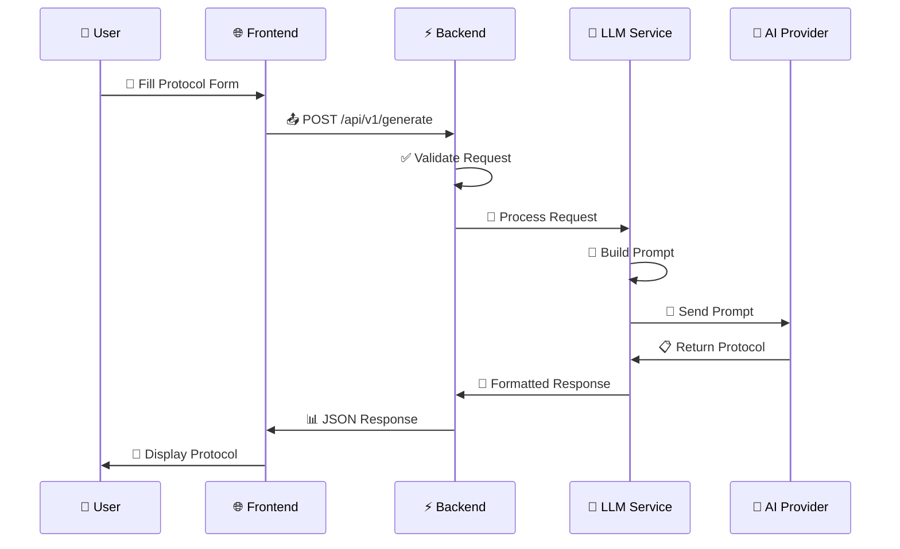
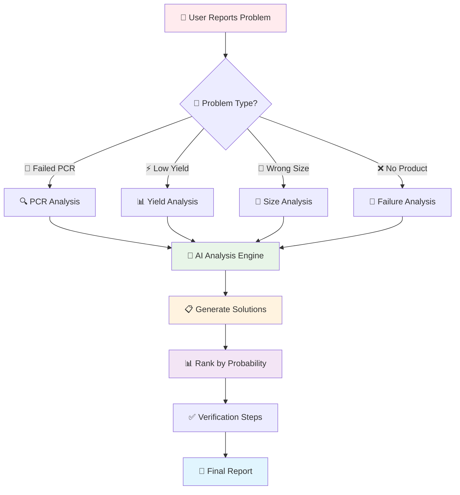
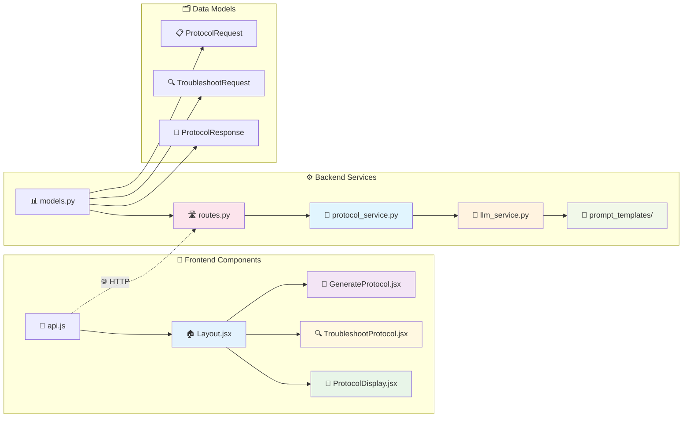
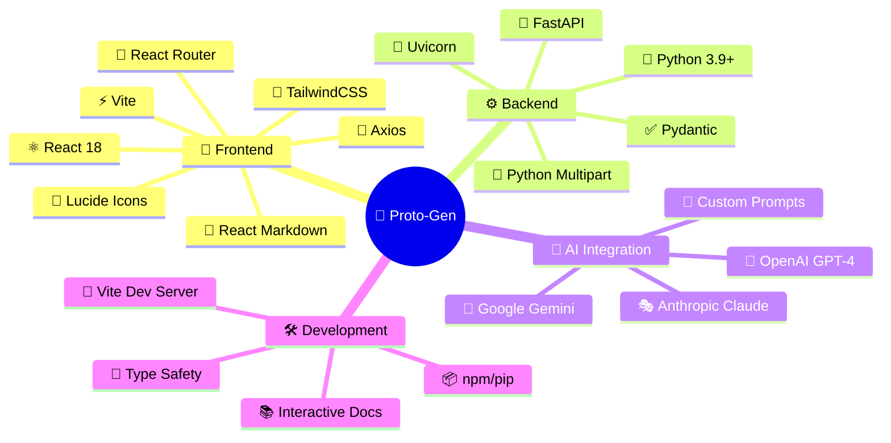
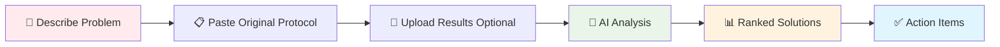

<div align="center">

# 🧬 Proto-Gen - AI Lab Protocol Assistant

[](https://opensource.org/licenses/MIT)
[](https://www.python.org/downloads/)
[](https://reactjs.org/)
[](https://fastapi.tiangolo.com/)
[](https://github.com/AshwithoutCash/ProtoGen)

**🚀 An intelligent laboratory protocol generation and troubleshooting assistant powered by Large Language Models**

*Accelerating research, one protocol at a time* 🔬✨

[🎯 Features](#-features) • [🏗️ Architecture](#️-architecture) • [⚡ Quick Start](#-quick-start) • [📚 Documentation](#-documentation) • [🤝 Contributing](#-contributing)

</div>

---

## 🎯 Features

<table>
<tr>
<td width="50%">

### 🧪 **Protocol Generation**
- 🔬 **11+ Laboratory Techniques** (PCR, qPCR, Gibson Assembly, etc.)
- 📋 **Detailed Step-by-Step Instructions**
- 🧮 **Automatic Volume Calculations**
- ⚙️ **Equipment Settings & Programs**
- 📝 **Materials & Reagents Lists**
- ⚠️ **Safety Guidelines & Best Practices**

</td>
<td width="50%">

### 🔍 **Protocol Troubleshooting**
- 🎯 **AI-Powered Problem Analysis**
- 📊 **Ranked Solution Suggestions**
- 🧠 **Expert-Level Reasoning**
- ✅ **Quick Verification Checklists**
- 🔄 **Iterative Problem Solving**
- 📈 **Success Rate Optimization**

</td>
</tr>
</table>

### 🌟 **Additional Features**
- 🤖 **Multiple LLM Support** (OpenAI, Anthropic, Gemini)
- 🎨 **Modern React UI** with TailwindCSS
- 📱 **Mobile-Responsive Design**
- 📋 **Copy & Download Protocols**
- 🔒 **Type-Safe API** with Pydantic
- ⚡ **Real-Time Generation** (5-10 seconds)

---

## 🏗️ Architecture

### 📊 **System Overview**



### 🔄 **Protocol Generation Flow**



### 🔍 **Troubleshooting Flow**



### 🏛️ **Component Architecture**



### 💾 **Technology Stack**



---

## ⚡ Quick Start

### 🚀 **One-Click Setup**

```bash
# 📥 Clone the repository
git clone https://github.com/AshwithoutCash/ProtoGen.git
cd ProtoGen

# 🔧 Backend Setup (Terminal 1)
cd backend
python -m venv venv
venv\Scripts\activate  # Windows
pip install -r requirements.txt

# 🔑 Configure API Keys
copy .env.example .env
# Edit .env with your API keys

# 🚀 Start Backend
python main.py

# 🎨 Frontend Setup (Terminal 2)
cd ../frontend
npm install
npm run dev
```

### 🔑 **API Key Configuration**

Create a `.env` file in the `backend` directory:

```env
# 💎 FREE Gemini API (Recommended)
GEMINI_API_KEY=your_gemini_key_here

# 🤖 Optional: Other Providers
OPENAI_API_KEY=your_openai_key_here
ANTHROPIC_API_KEY=your_anthropic_key_here

# ⚙️ Server Configuration
HOST=0.0.0.0
PORT=8000
CORS_ORIGINS=http://localhost:5173
```

> 💡 **Get FREE Gemini API Key**: Visit [Google AI Studio](https://makersuite.google.com/app/apikey)

### 🎯 **Access Points**

| Service | URL | Description |
|---------|-----|-------------|
| 🎨 **Frontend** | http://localhost:5173 | Main application interface |
| ⚡ **Backend API** | http://localhost:8000 | REST API endpoints |
| 📚 **API Docs** | http://localhost:8000/docs | Interactive API documentation |
| 🔍 **Health Check** | http://localhost:8000/health | Service status |

---

## 📖 Usage Guide

### 🧪 **Generating Protocols**

<table>
<tr>
<td width="50%">

#### 📝 **Step-by-Step Process**

1. 🏠 **Navigate** to the home page
2. 🧪 **Click** "Generate Protocol"
3. 📋 **Fill** the form with:
   - 🎯 Experimental Goal
   - 🔬 Core Technique
   - 🧪 Key Reagents/Enzymes
   - 🧬 Template Details
   - 🎯 Primer Information
4. 🚀 **Click** "Generate Protocol"
5. 📄 **Review** the generated protocol

</td>
<td width="50%">

#### 🔬 **Supported Techniques**

- 🧬 **PCR** (Polymerase Chain Reaction)
- 📊 **qPCR** (Quantitative PCR)
- 🔗 **Gibson Assembly**
- 🧪 **Miniprep** (Plasmid Extraction)
- ⚡ **Gel Electrophoresis**
- ✂️ **Restriction Digestion**
- 🔗 **Ligation**
- 🦠 **Transformation**
- 🧬 **DNA Extraction**
- 🔬 **Western Blot**
- 📊 **ELISA**

</td>
</tr>
</table>

### 🔍 **Troubleshooting Experiments**



#### 🎯 **Common Problem Categories**

| Problem Type | 🎯 Analysis Focus | 💡 Solution Types |
|--------------|-------------------|-------------------|
| 🚫 **No Product** | Primer design, enzyme activity | Redesign primers, check reagents |
| 📏 **Wrong Size** | Template issues, contamination | Verify template, clean samples |
| 📊 **Low Yield** | Reaction conditions, inhibitors | Optimize conditions, dilute samples |
| 🎯 **Multiple Bands** | Specificity issues, annealing | Adjust temperature, redesign primers |

---

## 📚 Documentation

### 📖 **Available Guides**

| Document | 📝 Description | 🎯 Audience |
|----------|----------------|-------------|
| [📋 QUICK_START.md](QUICK_START.md) | 5-minute setup guide | 🚀 New users |
| [🏗️ ARCHITECTURE.md](ARCHITECTURE.md) | System design details | 👨‍💻 Developers |
| [📡 API_DOCUMENTATION.md](API_DOCUMENTATION.md) | Complete API reference | 🔧 Integrators |
| [🧪 EXAMPLES.md](EXAMPLES.md) | Usage examples | 🔬 Researchers |
| [🔧 SETUP_GUIDE.md](SETUP_GUIDE.md) | Detailed installation | 🛠️ System admins |
| [🚨 TROUBLESHOOTING.md](TROUBLESHOOTING.md) | Common issues & fixes | 🆘 Support |

### 🔗 **Quick Links**

- 🤖 **AI Setup**: [GEMINI_SETUP.md](GEMINI_SETUP.md) - Free Gemini API configuration
- 🔥 **Firebase**: [FIREBASE_SETUP.md](FIREBASE_SETUP.md) - Database integration
- 📊 **Project Stats**: [PROJECT_SUMMARY.md](PROJECT_SUMMARY.md) - Comprehensive overview
- 📝 **Changes**: [CHANGELOG.md](CHANGELOG.md) - Version history

---

## 🛡️ Safety & Compliance

### ⚠️ **Important Disclaimer**

> **🚨 Critical Notice**: Proto-Gen is an AI assistant and **NOT a substitute** for:
> - 👨‍🔬 Expert scientific review
> - 🎓 Proper laboratory training  
> - 🏛️ Institutional safety protocols
> - 🧠 Professional judgment

### ✅ **Best Practices**

- 🔍 **Always verify** protocols with qualified professionals
- 🧪 **Test protocols** on small scales first
- 📋 **Follow institutional** safety guidelines
- 🤝 **Consult experienced** researchers
- 📊 **Monitor costs** and API usage

### 💰 **Cost Considerations**

| Provider | 💵 Cost per Protocol | 📊 Recommended Use |
|----------|---------------------|-------------------|
| 💎 **Gemini** | FREE | 🎯 Primary choice |
| 🤖 **OpenAI** | ~$0.01-0.05 | 🔧 Advanced features |
| 🎭 **Anthropic** | ~$0.02-0.08 | 🧠 Complex analysis |

---

## 🚀 Deployment Options

### 🌐 **Cloud Platforms**

<table>
<tr>
<td width="33%">

#### 🚀 **Backend Deployment**
- 🚂 **Railway** (Recommended)
- 🎨 **Render**
- ☁️ **Google Cloud Run**
- 🌩️ **AWS Lambda**
- 🔷 **Azure Container Instances**

</td>
<td width="33%">

#### 🎨 **Frontend Deployment**
- 🌐 **Netlify** (Recommended)
- 📦 **GitHub Pages**
- ☁️ **AWS S3 + CloudFront**
- 🔷 **Azure Static Web Apps**
- 🌊 **Surge.sh**

</td>
<td width="33%">

#### 🐳 **Container Deployment**
- 🐳 **Docker**
- ☸️ **Kubernetes**
- 🎯 **Docker Compose**
- 🌊 **Portainer**
- 📦 **Podman**

</td>
</tr>
</table>

### 🔧 **Environment Configuration**

```yaml
# 🚀 Production Environment
ENVIRONMENT=production
DEBUG=false
LOG_LEVEL=info

# 🔒 Security Settings
CORS_ORIGINS=https://your-domain.com
API_RATE_LIMIT=100
MAX_REQUEST_SIZE=10MB

# 🤖 AI Configuration
DEFAULT_LLM_PROVIDER=gemini
FALLBACK_PROVIDER=openai
MAX_TOKENS=4000
```

---

## 🤝 Contributing

### 🎯 **How to Contribute**

```mermaid
gitgraph
    commit id: "🍴 Fork Repo"
    branch feature
    checkout feature
    commit id: "✨ Add Feature"
    commit id: "🧪 Add Tests"
    commit id: "📝 Update Docs"
    checkout main
    merge feature
    commit id: "🚀 Deploy"
```

### 📋 **Contribution Areas**

<table>
<tr>
<td width="50%">

#### 🔬 **Scientific Content**
- 🧪 New laboratory techniques
- 📝 Improved prompt templates
- 🎯 Better troubleshooting logic
- 📚 Domain expertise

</td>
<td width="50%">

#### 💻 **Technical Improvements**
- 🤖 New LLM providers
- 🎨 UI/UX enhancements
- ⚡ Performance optimizations
- 🧪 Test coverage

</td>
</tr>
</table>

### 🛠️ **Development Setup**

```bash
# 🍴 Fork and clone
git clone https://github.com/yourusername/ProtoGen.git
cd ProtoGen

# 🔧 Install development dependencies
pip install -r requirements-dev.txt
npm install --include=dev

# 🧪 Run tests
pytest backend/tests/
npm test

# 📝 Format code
black backend/
prettier --write frontend/src/
```

---

## 📊 Project Statistics

<div align="center">

### 📈 **Codebase Metrics**

| Metric | 📊 Value | 📝 Description |
|--------|----------|----------------|
| 📁 **Total Files** | 40+ | Complete project files |
| 📝 **Lines of Code** | 3,500+ | Backend + Frontend |
| 🧪 **Techniques Supported** | 11+ | Laboratory protocols |
| 🤖 **LLM Providers** | 3 | OpenAI, Anthropic, Gemini |
| 📚 **Documentation Files** | 15+ | Comprehensive guides |
| 🌍 **Languages** | 3 | Python, JavaScript, Markdown |

</div>

### 🏆 **Key Achievements**

- ✅ **Production-Ready** full-stack application
- ✅ **Type-Safe** API with comprehensive validation
- ✅ **Modular Architecture** for easy extensibility
- ✅ **Expert-Level** prompt engineering
- ✅ **Mobile-Responsive** modern UI
- ✅ **Comprehensive** documentation suite

---

## 📞 Support & Community

### 🆘 **Getting Help**

1. 📚 **Check Documentation** - Start with relevant guides
2. 🔍 **Search Issues** - Look for existing solutions
3. 💬 **Ask Questions** - Create detailed issue reports
4. 🤝 **Join Community** - Connect with other users

### 🐛 **Reporting Issues**

```markdown
## 🐛 Bug Report Template

**🎯 Expected Behavior:**
Describe what should happen

**❌ Actual Behavior:**
Describe what actually happens

**🔄 Steps to Reproduce:**
1. Step one
2. Step two
3. Step three

**🌍 Environment:**
- OS: [Windows/Mac/Linux]
- Python: [Version]
- Node.js: [Version]
- Browser: [Chrome/Firefox/Safari]

**📋 Additional Context:**
Any other relevant information
```

---

## 📄 License & Legal

### 📜 **MIT License**

```
MIT License

Copyright (c) 2024 Proto-Gen Contributors

Permission is hereby granted, free of charge, to any person obtaining a copy
of this software and associated documentation files (the "Software"), to deal
in the Software without restriction, including without limitation the rights
to use, copy, modify, merge, publish, distribute, sublicense, and/or sell
copies of the Software, and to permit persons to whom the Software is
furnished to do so, subject to the following conditions:

The above copyright notice and this permission notice shall be included in all
copies or substantial portions of the Software.

THE SOFTWARE IS PROVIDED "AS IS", WITHOUT WARRANTY OF ANY KIND, EXPRESS OR
IMPLIED, INCLUDING BUT NOT LIMITED TO THE WARRANTIES OF MERCHANTABILITY,
FITNESS FOR A PARTICULAR PURPOSE AND NONINFRINGEMENT. IN NO EVENT SHALL THE
AUTHORS OR COPYRIGHT HOLDERS BE LIABLE FOR ANY CLAIM, DAMAGES OR OTHER
LIABILITY, WHETHER IN AN ACTION OF CONTRACT, TORT OR OTHERWISE, ARISING FROM,
OUT OF OR IN CONNECTION WITH THE SOFTWARE OR THE USE OR OTHER DEALINGS IN THE
SOFTWARE.
```

---

<div align="center">

## 🌟 **Built with ❤️ for the Scientific Community**

### 🚀 **Accelerating Research, One Protocol at a Time** 🧬

[](https://github.com/AshwithoutCash/ProtoGen)
[](https://github.com/AshwithoutCash/ProtoGen)
[](https://github.com/AshwithoutCash/ProtoGen)

**[⭐ Star this repo](https://github.com/AshwithoutCash/ProtoGen) • [🍴 Fork it](https://github.com/AshwithoutCash/ProtoGen/fork) • [📢 Share it](https://twitter.com/intent/tweet?text=Check%20out%20Proto-Gen%20-%20AI%20Lab%20Protocol%20Assistant!&url=https://github.com/AshwithoutCash/ProtoGen)**

</div>
